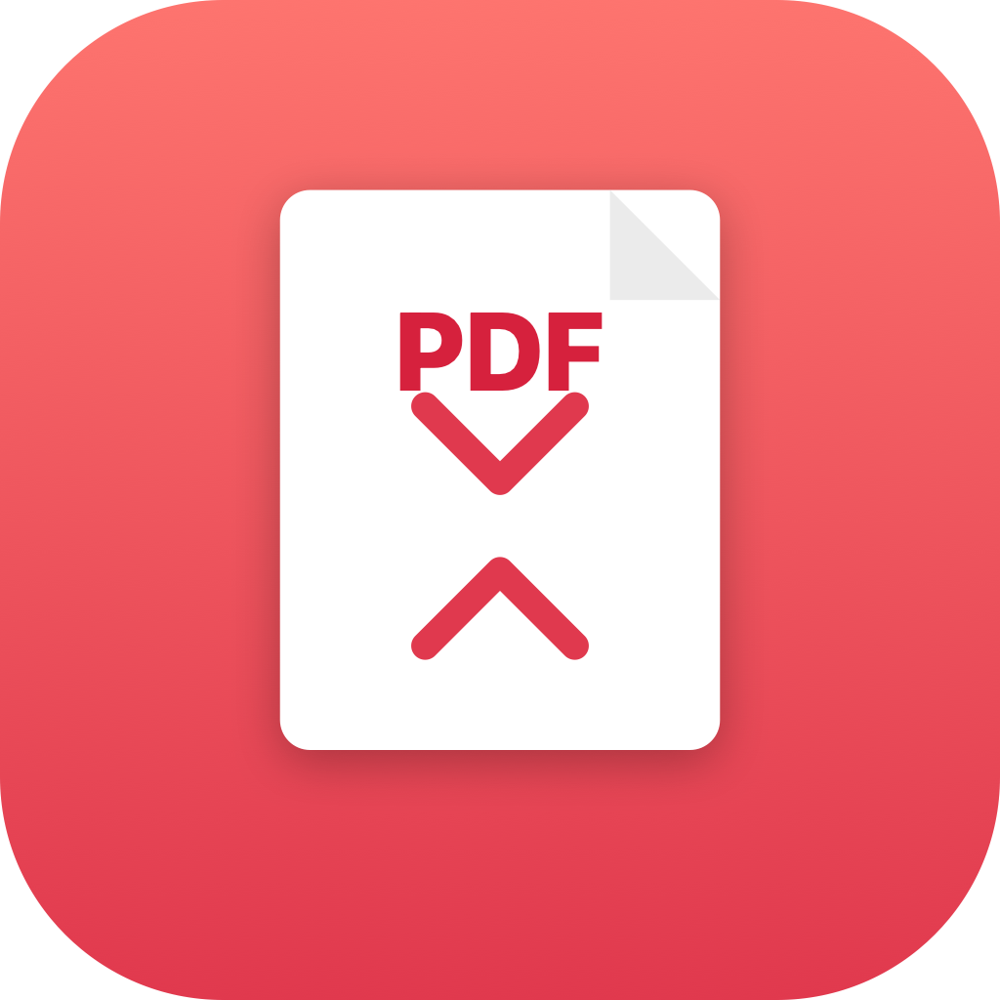

<div align="center">



# PDF 压缩 · PDF Compressor for macOS

**一个纯本地、不联网的 macOS PDF 压缩小工具**
拖进去，选档位，一键压缩。文件不上传，文字保持清晰。

[](https://www.apple.com/macos/)
[](https://developer.apple.com/swift/)
[](LICENSE)

</div>

---

## ✨ 特点

- **纯本地处理**：使用 macOS 内置的 Quartz 压缩引擎，文件**不上传、不联网**，无任何外部依赖（不需要 Ghostscript）。
- **文字保持清晰**：只重新压缩 / 降采样内嵌图片，文字仍是矢量，不会变糊。
- **绝不把文件压大**：压缩后会和原文件比大小，如果压完反而更大（常见于纯文字 PDF），自动保留原件并提示「已是最优」。
- **批量压缩**：支持一次拖入多个 PDF。
- **三档可选**：高质量 / 推荐 / 强力压缩。
- **输出安全**：不覆盖原文件，在同目录生成 `原名_compressed.pdf`，可一键在访达中定位。

## 📊 压缩效果（图片型 PDF 实测）

| 档位 | 压缩后体积 | 适用场景 |
|------|-----------|----------|
| 高质量 | ~88% | 打印、存档，几乎无损 |
| 推荐 | ~51% | 日常使用，平衡体积与画质 |
| 强力压缩 | ~30% | 微信 / 邮件分享，体积优先 |

> 纯文字类 PDF 通常本身已高度压缩，无进一步压缩空间，工具会自动保留原件。

---

## 📥 下载与安装

### 方式一：直接下载（推荐给普通用户）

1. 打开 [**Releases 页面**](../../releases/latest)，下载 `PDF-Compressor-mac.zip`。
2. 解压，把 **PDF 压缩.app** 拖进「应用程序」文件夹。
3. **第一次打开**：右键点图标 → **打开** → 再点一次 **打开**。
   （因为是本地未签名 App，只需这样操作一次，之后可直接双击。）

> 如果双击提示「无法打开，因为无法验证开发者」，就用上面的右键方式打开一次即可。

### 方式二：自己从源码编译

需要 macOS 自带的 Swift 工具链（安装 Xcode 或 Command Line Tools 即可）。

```bash
git clone https://github.com/antyxiong333/pdf-compressor-mac.git
cd pdf-compressor-mac
./build.sh
```

编译完成后当前目录会生成 **PDF 压缩.app**，双击即可运行。

---

## 🚀 使用方法

1. 打开 **PDF 压缩.app**。
2. 把一个或多个 PDF **拖进窗口**（或点「选择文件…」）。
3. 在底部选择压缩档位：**高质量 / 推荐 / 强力压缩**。
4. 点 **开始压缩**。
5. 压缩完成后，每个文件会显示「原大小 → 新大小 · 省 xx%」，点文件夹图标可在访达中定位输出文件。

输出文件为 `原文件名_compressed.pdf`，与原文件放在同一目录，**不会覆盖原文件**。

---

## 🔧 技术说明

- 语言 / 框架：**Swift + SwiftUI**
- 压缩引擎：macOS **Quartz Filter**（`QuartzFilter` + `CGContext`），对内嵌图片做 JPEG 重压缩与按 DPI 降采样，同时保留矢量文字。
- 无第三方依赖，单文件源码：[`Sources/main.swift`](Sources/main.swift)
- 图标由 [`makeicon.swift`](makeicon.swift) 用 Core Graphics 生成。

## 📁 项目结构

```
pdf-compressor-mac/
├── Sources/main.swift   # 全部 App 源码（UI + 压缩引擎）
├── makeicon.swift       # 生成 App 图标
├── build.sh             # 一键编译成 .app
├── icon_1024.png        # 图标源图
├── AppIcon.icns         # 编译好的图标
└── README.md
```

## ⚠️ 说明

- 本工具完全在本地运行，不收集、不上传任何数据。
- App 未做 Apple 公证签名，故首次打开需右键「打开」。
- 使用前建议保留原文件（本工具默认不覆盖原文件）。

## 📄 License

[MIT](LICENSE)
