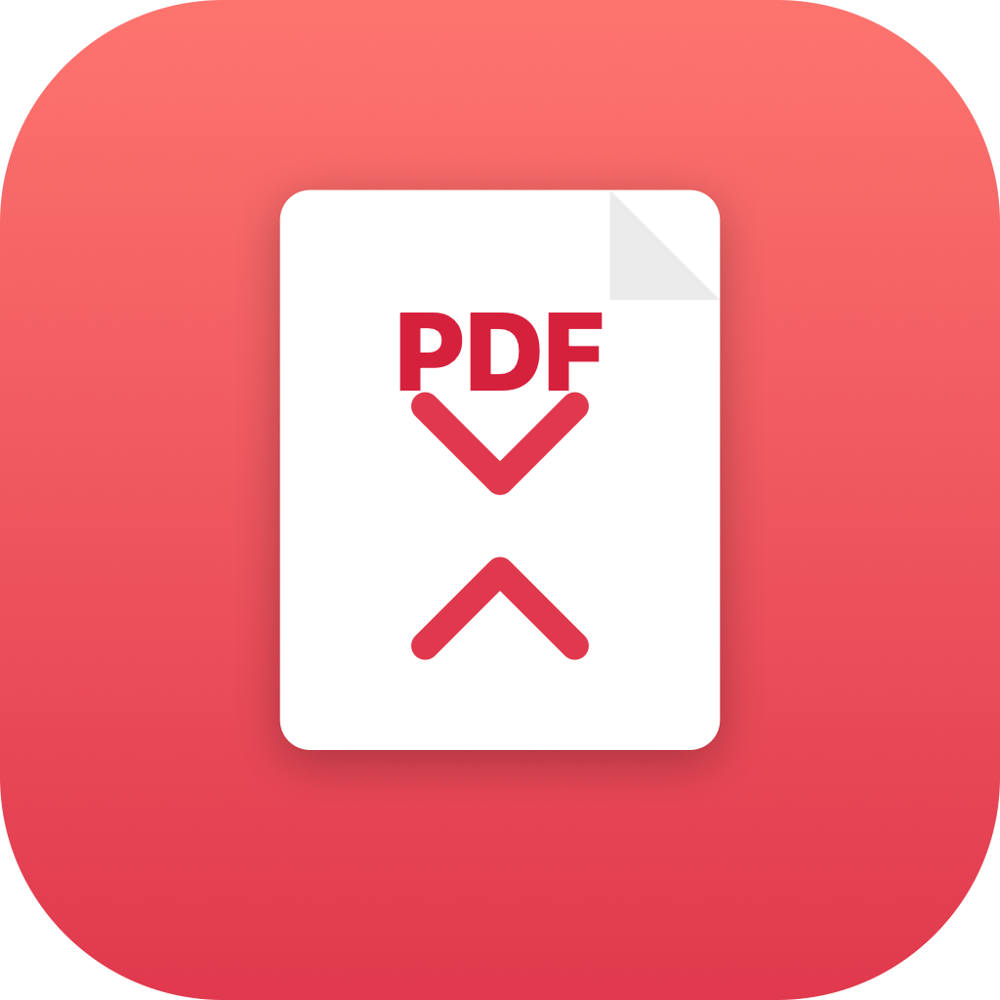

<div align="center">



# PDF / 图片 压缩 · PDF & Image Compressor for macOS

**A fully local, offline macOS compressor for PDFs and images — drag in, pick a level, done.**
**纯本地、不联网的 macOS 压缩小工具，支持 PDF 与图片 —— 拖进去，选档位，一键压缩。**

[](https://www.apple.com/macos/)
[](https://developer.apple.com/swift/)
[](LICENSE)

**English** · [中文](#中文说明)

</div>

---

## English

### ✨ Features

- **PDF + Images** — compress PDF files and images (JPG / PNG / HEIC / HEIF / TIFF / BMP) in the same window.
- **100% local** — uses macOS's built-in Quartz / ImageIO engines. Files are **never uploaded**, no network, no external dependencies (no Ghostscript needed).
- **Quality-preserving** — PDFs keep text as sharp vectors (only embedded images are recompressed); images are downsampled + re-encoded with high-quality resampling. Transparent PNGs stay lossless PNG.
- **Never bloats your file** — the result is compared against the original; if compression doesn't help (common for text-only PDFs or already-small images), the original is kept and it tells you "already optimal."
- **Batch** — drop in many files at once, mix PDFs and images freely.
- **Three levels** — High quality / Recommended / Strong.
- **Safe output** — never overwrites the original; writes `name_compressed.ext` next to it, one click to reveal in Finder.

### 📊 Compression results (measured)

| Level | Image-heavy PDF | Photo (JPG) | Best for |
|-------|-----------------|-------------|----------|
| High quality | ~88% | ~83% | Printing / archiving, near-lossless |
| Recommended | ~51% | ~36% | Everyday use, balanced |
| Strong | ~30% | ~12% | Email / chat sharing, smallest size |

> Text-only PDFs and already-optimized images have little to gain — the tool keeps the original in that case.

### 📥 Download & Install

**Option A — Download (for most users)**

1. Open the [**Releases page**](../../releases/latest) and download `PDF-Compressor-mac.zip`.
2. Unzip, drag **PDF 压缩.app** into your **Applications** folder.
3. **First launch**: right-click the icon → **Open** → **Open** again.
   (It's an unsigned local app, so you only need to do this once.)

**Option B — Build from source**

Requires the Swift toolchain (Xcode or Command Line Tools).

```bash
git clone https://github.com/antyxiong333/pdf-compressor-mac.git
cd pdf-compressor-mac
./build.sh
```

This produces **PDF 压缩.app** in the folder — double-click to run.

### 🚀 How to use

1. Open **PDF 压缩.app**.
2. Drag one or more PDFs and/or images into the window (or click "选择文件… / Choose files").
3. Pick a level at the bottom: **High quality / Recommended / Strong**.
4. Click **开始压缩 (Compress)**.
5. Each file shows `original → new · saved xx%`. Click the folder icon to reveal the output in Finder.

Output is `originalname_compressed.ext` in the same folder — **the original is never overwritten**.

### 🔧 Technical notes

- **Swift + SwiftUI**, single source file: [`Sources/main.swift`](Sources/main.swift).
- PDF engine: macOS **Quartz Filter** (`QuartzFilter` + `CGContext`) — JPEG-recompresses and DPI-downsamples embedded images while keeping vector text.
- Image engine: **ImageIO** (`CGImageSource` / `CGImageDestination`) — high-quality downsampling + JPEG re-encoding, transparency-aware.
- No third-party dependencies. Icon generated by [`makeicon.swift`](makeicon.swift) via Core Graphics.

### ⚠️ Notes

- Runs entirely locally; collects and uploads nothing.
- The app is not Apple-notarized, hence the right-click "Open" on first launch.
- Keep your originals as a habit (the tool never overwrites them anyway).

---

<a name="中文说明"></a>

## 中文说明

### ✨ 特点

- **PDF + 图片**：同一个窗口里既能压 PDF，也能压图片（JPG / PNG / HEIC / HEIF / TIFF / BMP）。
- **纯本地处理**：使用 macOS 内置的 Quartz / ImageIO 引擎，文件**不上传、不联网**，无任何外部依赖（不需要 Ghostscript）。
- **尽量保画质**：PDF 只重压内嵌图片、文字仍是矢量不变糊；图片用高质量重采样降分辨率再编码，带透明的 PNG 仍保留为无损 PNG。
- **绝不把文件压大**：压缩后会和原文件比大小，如果压完反而更大（常见于纯文字 PDF 或本来就很小的图片），自动保留原件并提示「已是最优」。
- **批量压缩**：支持一次拖入多个文件，PDF 和图片可混着拖。
- **三档可选**：高质量 / 推荐 / 强力压缩。
- **输出安全**：不覆盖原文件，在同目录生成 `原名_compressed.后缀`，可一键在访达中定位。

### 📊 压缩效果（实测）

| 档位 | 图片型 PDF | 照片（JPG） | 适用场景 |
|------|-----------|------------|----------|
| 高质量 | ~88% | ~83% | 打印、存档，几乎无损 |
| 推荐 | ~51% | ~36% | 日常使用，平衡体积与画质 |
| 强力压缩 | ~30% | ~12% | 微信 / 邮件分享，体积优先 |

> 纯文字类 PDF、以及本来就压得很小的图片，通常没有进一步压缩空间，工具会自动保留原件。

### 📥 下载与安装

**方式一：直接下载（推荐给普通用户）**

1. 打开 [**Releases 页面**](../../releases/latest)，下载 `PDF-Compressor-mac.zip`。
2. 解压，把 **PDF 压缩.app** 拖进「应用程序」文件夹。
3. **第一次打开**：右键点图标 → **打开** → 再点一次 **打开**。
   （因为是本地未签名 App，只需这样操作一次，之后可直接双击。）

**方式二：自己从源码编译**

需要 macOS 自带的 Swift 工具链（安装 Xcode 或 Command Line Tools 即可）。

```bash
git clone https://github.com/antyxiong333/pdf-compressor-mac.git
cd pdf-compressor-mac
./build.sh
```

编译完成后当前目录会生成 **PDF 压缩.app**，双击即可运行。

### 🚀 使用方法

1. 打开 **PDF 压缩.app**。
2. 把一个或多个 PDF / 图片 **拖进窗口**（或点「选择文件…」）。
3. 在底部选择压缩档位：**高质量 / 推荐 / 强力压缩**。
4. 点 **开始压缩**。
5. 压缩完成后，每个文件会显示「原大小 → 新大小 · 省 xx%」，点文件夹图标可在访达中定位输出文件。

输出文件为 `原文件名_compressed.后缀`，与原文件放在同一目录，**不会覆盖原文件**。

### 🔧 技术说明

- 语言 / 框架：**Swift + SwiftUI**，单文件源码：[`Sources/main.swift`](Sources/main.swift)
- PDF 引擎：macOS **Quartz Filter**（`QuartzFilter` + `CGContext`），对内嵌图片做 JPEG 重压缩与按 DPI 降采样，同时保留矢量文字。
- 图片引擎：**ImageIO**（`CGImageSource` / `CGImageDestination`），高质量降采样 + JPEG 重编码，自动识别透明通道。
- 无第三方依赖，图标由 [`makeicon.swift`](makeicon.swift) 用 Core Graphics 生成。

### ⚠️ 说明

- 本工具完全在本地运行，不收集、不上传任何数据。
- App 未做 Apple 公证签名，故首次打开需右键「打开」。
- 使用前建议保留原文件（本工具默认不覆盖原文件）。

---

## 📁 Project structure / 项目结构

```
pdf-compressor-mac/
├── Sources/main.swift   # App source (UI + compression engine) / 全部源码
├── makeicon.swift       # Generates the app icon / 生成图标
├── build.sh             # One-shot build to .app / 一键编译
├── icon_1024.png        # Icon source / 图标源图
├── AppIcon.icns         # Compiled icon / 编译好的图标
└── README.md
```

## 📄 License

[MIT](LICENSE)
